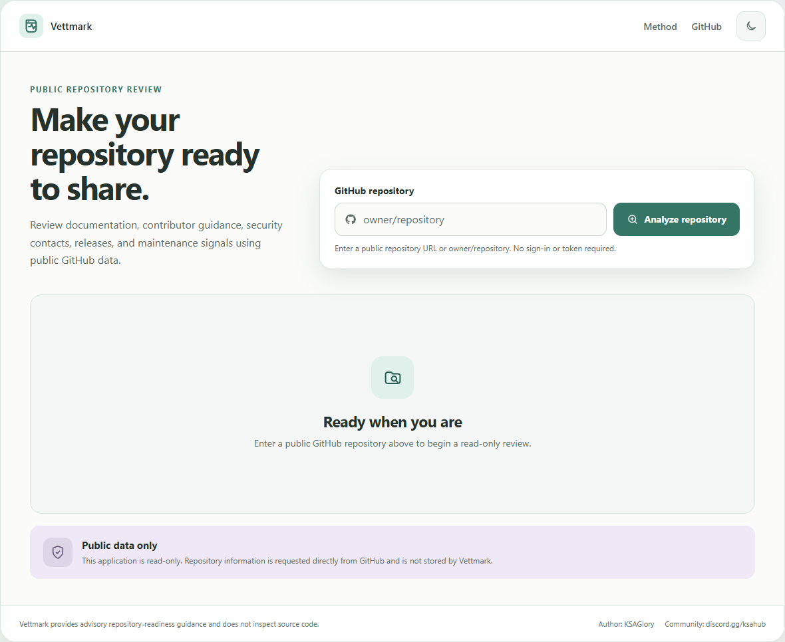
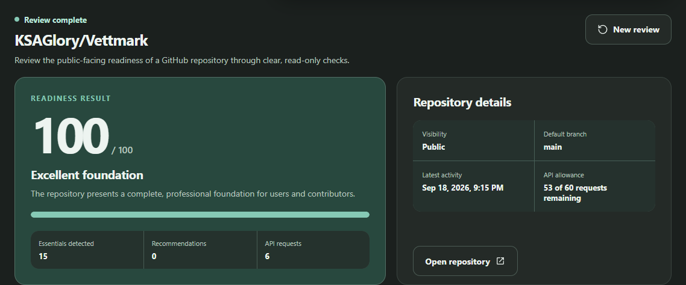

# Vettmark

[](https://github.com/KSAGlory/Vettmark/actions/workflows/quality.yml)
[](https://github.com/KSAGlory/Vettmark/actions/workflows/pages.yml)

Review the public-facing readiness of a GitHub repository through clear, read-only checks.

[Open Vettmark](https://ksaglory.github.io/Vettmark/)



## Overview

Vettmark helps developers prepare a public repository for users, contributors, employers, and clients. Enter a GitHub repository URL or `owner/repository` value to receive a 100-point readiness score, category details, detected strengths, and prioritized recommendations.

The report uses public metadata from the official GitHub REST API. It is advisory and does not replace source-code review, security testing, or legal guidance.

## Report



Each review checks:

- Project documentation, including the README, description, website, and topics
- Contribution guidance, including contributing instructions and community templates
- Security policy and detected license information
- Maintenance signals exposed by GitHub
- Release availability and public release details
- Clear, prioritized recommendations for missing essentials

The complete scoring method is documented in [Repository Readiness Method](docs/METHOD.md).

## How it works

1. Enter a public GitHub repository URL or `owner/repository` value.
2. The application retrieves the required public information from the GitHub REST API.
3. Review the readiness score, evidence, strengths, and recommended improvements.

A standard review uses no more than six read-only API requests. If required evidence is unavailable, the application marks the report incomplete instead of treating unknown checks as failures.

## Privacy and security

Vettmark is a static GitHub Pages application with no application backend.

- No account or sign-in
- No personal access token
- No analytics, advertising, cookies, or tracking
- No application database or saved search history
- No write operations
- No access to private repositories

The browser sends the repository reference directly to GitHub. See [Privacy](PRIVACY.md) and [Security](SECURITY.md) for the complete boundaries.

## Technology

- Semantic HTML, modern CSS, and JavaScript modules
- GitHub REST API for public repository data
- GitHub Pages for static hosting
- Node.js tests and Playwright browser validation
- Automated accessibility, dependency, and security checks

The application has no production package dependencies.

## Local development

Node.js 22 or later is required.

```text
npm install
npm run dev
npm run check
npm run test:browser
npm run build
```

Run `npm run screenshots` to refresh the README images from the deployed application. Set `SCREENSHOT_URL` to capture another approved deployment.

## Quality

- 37 unit and integration tests
- Automated Google Chrome workflow tests
- WCAG 2.2 A and AA automated checks in light and dark modes
- Keyboard, responsive layout, reduced-motion, and error-state reviews
- Zero known dependency vulnerabilities at publication
- Production Lighthouse scores of 100 for Performance, Accessibility, and Best Practices

See [Quality Review](docs/QUALITY.md) for scope and limitations.

## Documentation

- [Repository Readiness Method](docs/METHOD.md)
- [Technical Architecture](docs/ARCHITECTURE.md)
- [Quality Review](docs/QUALITY.md)
- [Privacy](PRIVACY.md)
- [Security](SECURITY.md)
- [Support](SUPPORT.md)
- [Contributing](CONTRIBUTING.md)
- [Code of Conduct](CODE_OF_CONDUCT.md)

## Contributing

Read [CONTRIBUTING.md](CONTRIBUTING.md) before proposing a change. Product ideas, reproducible bug reports, and clearly described accessibility improvements are welcome through GitHub Issues.

## License

This project is licensed under the [MIT License](LICENSE).

## Author and community

- **Author:** KSAGlory
- **Community:** [discord.gg/ksahub](https://discord.gg/ksahub)
